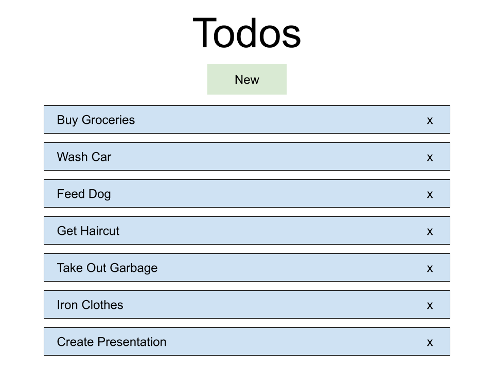
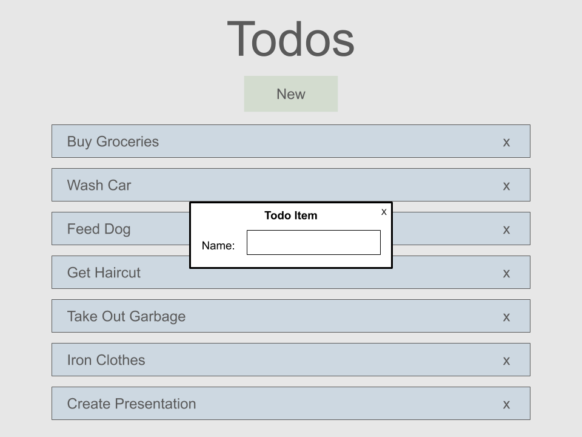

# Todo List Web App Kata Seed
A seed project for the Todo List Web App Kata

## Kata Goal
Create a web application for managing a collection of items in a todo list.

## Examples
Todo List

Add Todo Item 


## Requirements
* Must Have
  * Basic todo data
    * title
  * Display a list of todos
  * Create a new item
  * Delete an item
* Nice to have
  * Additional todo data
    * Due date
    * Priority
    * ...
  * Pagination of items
  * Sorting of items
* Stretch
  * Modular code (can you organize your code such that it is divided into modules with well defined responsibilities instead of a single script?)
  * Optimize loading (Can some parts of the application be loaded asynchronously?)
  * Add user accounts
  * Store todos in a database and update when items are created and deleted
  * Send notifications

## Using the Seed Project
* In order to hit the ground running, a seed project is provided that implements the most basic architecture of a web application.
  * Edit the files under src to build your app and its tests
  * In order to get started quickly and include all group members of various experience levels, I encourage you to start out building your app in a single js file. The code can later be modularized as a stretch goal.
  * A CSS file is provided, which will allow you to style your application as desired. However, I discourage you from spending much time styling as it will have minimal impact on the tests and therefore doesn’t fit well with the TDD theme of the Kata.
* Scripts
  * A collection of scripts are provided that make it easy to perform the various parts of the app development workflow
  * ```npm start``` serves the application and watches for changes, automatically updating the app running in the browser. By default, the app will be available at http://localhost:8080 
  * ```npm test``` runs the tests and watches for changes, automatically rerunning the tests when a change is detected.

## Tips
* To update the todo list as items are added and removed, we can use vanilla javascript as described in this handy [dom manipulation cheat sheet](https://gist.github.com/thegitfather/9c9f1a927cd57df14a59c268f118ce86#add-elements-to-the-dom)
* Test Strategies
  * Using the Karma test runner gives us access to the dom and allows us to exercise methods that interact with the dom and verify their effects
    * if the test changes the dom and performs assertions on it, it is important to setup and teardown the test fixture appropriately via the beforeEach and afterEach functions
  * It is typically much more convenient to organize the application into stateless functions or functions into which dependencies can be injected. 
    * For example, a method that takes in a dom node to be updated in some way can be tested by passing in a spy and performing verifications on the spy, rather than the dom.

## Tools Used
* Gulp: The build system we will use for running our tests and serving out app. Configured via gulpfile.js
* Karma: The test runner that lets us run our tests in a real browser. Configured via karma.conf.js
* Jasmine: The testing framework that “comes out of the box with everything you need to test your code.”

##  Getting Started
This kata can be executed in two environments
 * Locally 
    * clone this repo:  ```git clone https://github.com/albertpatterson/Todo-List-Kata-Seed.git```
    * install ```npm install```
    * use the provided scripts (described above) to run the server and the test
 * REPL.it
    * REPL.it is a great tool that provides an instant IDE for a variety of languages.
      * It's great for hacking, but needs a little tweeking to use testing tools. A REPL with those tweeks is provided. 
    * A REPL for this kata is available at https://repl.it/@apatterson189/Todo-List-Kata-Seed
    * Fork the REPL via the "Fork" button in the top middle of the page
    * edit index.js to choose the script to run.
    * create the Todo List using the files under /src
    * do not edit the files under /DO_NOT_EDIT
